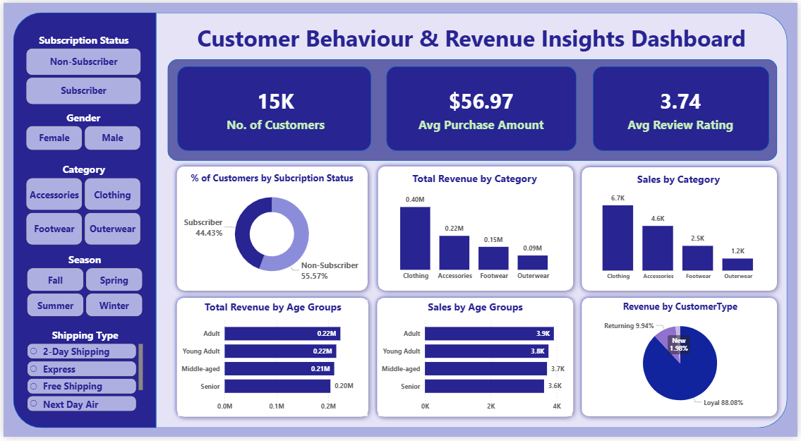

# 📊 Customer Behaviour & Revenue Insights Analysis

## Executive Summary

A retail company is experiencing shifts in customer purchasing patterns across demographics, product categories, and seasons. To uncover the root causes and identify opportunities for higher revenue and better engagement, I analyzed 15,000+ transactions using Python, SQL, and Power BI.

This project reveals which factors — such as **discounts, seasons, reviews, subscription status, and product categories** — most strongly influence spending and repeat purchases. Insights from this analysis show clear opportunities to improve loyalty, seasonal planning, and discount strategy.

**Key Findings:**

* **Total Customers:** 15,000
* **Average Purchase Amount:** $56.97
* **Average Review Rating:** 3.74
* **Top Category by Revenue:** Clothing
* **Most Active Season:** Winter

**Recommendation at a Glance:**
Increase subscription adoption, refine discount policies, and align inventory with strong seasonal demand.

---

## 🧩 Business Problem

The company wants to understand what drives customer purchases and why behavior differs across demographic groups, product categories, seasons, and regions. Stakeholders have observed inconsistent engagement and want actionable insights to optimize:

* Marketing strategy
* Product assortment
* Discount usage
* Customer retention and loyalty

**Guiding Question:**
**“How can the company leverage consumer shopping data to identify trends, improve customer engagement, and optimize marketing and product strategies?”**



---

## 🔍 Methodology

### 1. **Python (EDA & Transformation)**

* Cleaned and prepared raw data (`raw_data.csv`)
* Handled missing review ratings category wise
* Engineered age groups & purchase frequency
* Standardized categorical fields
* Exported cleaned dataset for SQL + BI

### 2. **SQL (Business Analysis)**

Insightful queries were written to answer key business questions such as:

* Revenue by gender, age group, season, and location
* Top products by sales & rating
* Subscription vs non-subscription behaviour
* Discount dependency by category
* Loyal vs returning vs new customer segments

### 3. **Power BI (Dashboard)**

Developed an interactive dashboard to visualize:

* Revenue & sales breakdowns
* Category and seasonal performance
* Customer profile trends
* Subscription impact
* Discounts, shipping types & review distribution

---

## 🛠 Skills Demonstrated

### **SQL:**

CTEs, Window Functions, CASE statements, Ranking, Aggregations, Segmentation logic

### **Python:**

Pandas, NumPy, Matplotlib/Seaborn, Feature Engineering, Data Cleaning

### **Power BI:**

DAX, Data Modeling, Interactive Visuals, KPI Design, Slicers & Filters

---

## 📈 Results & Recommendations

This project uncovered several high-impact insights:

* **Subscribers spend more and buy more frequently**, indicating strong potential for loyalty growth.
* **Winter has the highest spending volume**, suggesting seasonal marketing and inventory boosts.
* **Clothing dominates revenue**, but other categories show strong discount dependency.
* **Express shipping correlates with higher review ratings**, reflecting better customer satisfaction.
* **Locations vary significantly in revenue contribution**, offering targeted marketing opportunities.

### 🚀 Recommendations

1. **Boost subscription adoption** through incentives and personalized benefits.
2. **Optimize discount strategy** by reducing dependency in low-margin categories.
3. **Strengthen seasonal planning**, especially for Winter demand spikes.
4. **Leverage high-value customer segments** (loyal & frequent buyers) with targeted offers.
5. **Improve product and shipping experiences** in low-rated categories/regions.

These actions will help increase revenue, customer satisfaction, and long-term loyalty.

---

## 📂 Repository Structure

```
customer-behavior-analysis/
│── raw_data.csv
│── python_eda.ipynb
│── sql_analysis.sql
│── customer_behaviour_dashboard.pbix
│── Customer_Behaviour_Analysis.pdf
│── requirements.txt
│── README.md
```

---

## 🚀 Next Steps

1. Build predictive models (CLV, churn, product recommendations).
2. Apply A/B testing for discount strategies and subscription messaging.
3. Introduce customer cohorts for deeper retention analysis.
4. Expand dashboard with time-series forecasting.


